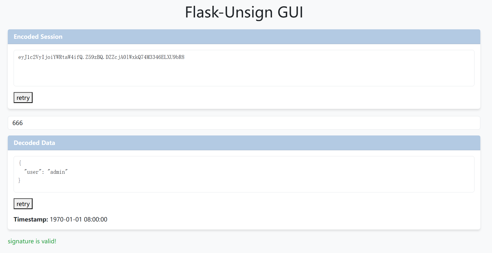

<h1><center>flask-unsign-gui</center></h1>

[使用方法](#使用方法)

[下载方法](#下载方法)

[flask session原理](#session原理)


## 使用方法

在encoded Session文字框中输入session会自动解码(base64),不需要密钥, 在decoded data文字框中输入解密后的内容会利用secret作为密钥加密,得到session.(此时secret不能为空).
添加或修改密钥后需要得到新的结果,请点击`retry`,上面一个`retry`用于密钥修改后验证session是否是有效的或验证密钥是否正确. 下面一个`retry`用于密钥修改后重新生成session.

爆破密钥功能待完善...

## 下载方法
```sh
pip3 install flask-unsign;
https://github.com/mekrina/flask-unsign-gui.git;
cd flask-unsign-gui;
python3 app.py;
```
访问[http://localhost:5000](http://localhost:5000)即可
## session原理

flask框架中的session由三部分组成，用`.`间隔
```
# session示例
eyJhZG1pbiI6MH0.Z4TvGQ.6pZj4EsHiALdBjTc_STIl9XRU5Q
```
**第一部分**$~~~~$eyJhZG1pbiI6MH0
是base64编码的结果, 这里解码后就是
```
{"admin":0}
```
**第二部分** $~$ Z4TvGQ
时间戳
**第三部分**$~~~~$6pZj4EsHiALdBjTc_STIl9XRU5Q
用secret作为密钥对第一部分和第二部分进行加密（hmac-sha算法）

session工作流程
1. 用户访问，服务端为用户添加标记信息（如{"admin":0}），加时间戳，加密。分别作为session的三部分。
2. 用户带着session字符串访问服务端，服务器对session第一第二部分进行认证，认证(加密)结果与第三部分进行比较。相同则认证成功。

